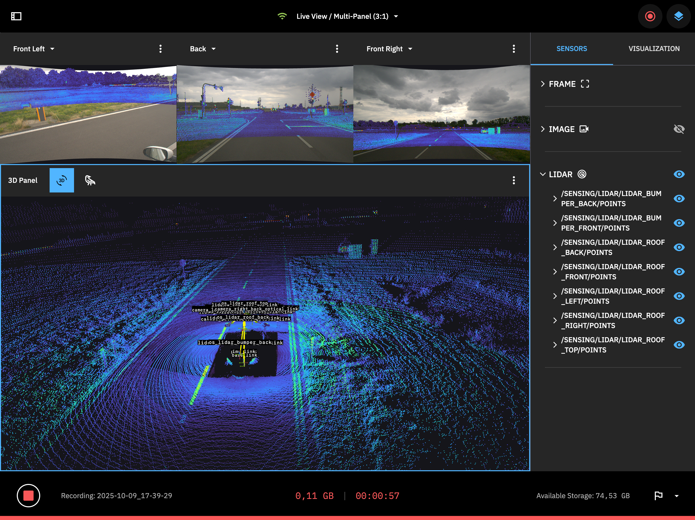

# Co-Designed HMI for Autonomous Research: A Case Study on Flexibility, Integration, and Collaboration

## Abstract

In-field data collection and system development for autonomous systems presents a significant human workflow challenge. This paper presents a case study on a structured, multi-method co-design process to bridge the gap between engineering and design. The resulting flexible HMI Interface is successfully applied to two platforms (car and bicycle), providing easy touch access to core functionalities for a single operator, while reserving expert control for a co-operator. We conclude with a set of critical lessons learned for real-world HMI development, providing a model for other interdisciplinary teams.

<table width="100%">
<td colspan="3" align="center">HMI in different settings:</td></tr>
  <tr>
    <td align="center">
      
       
      <em>Live-view with sensor warnings</em>
    </td>
    <td align="center">
      
       
      <em>Basic recording setup</em>
    </td>
    <td align="center">
      
       
      <em>Flags with timestamp</em>
    </td>
  </tr>
  <tr>
  
</table>
